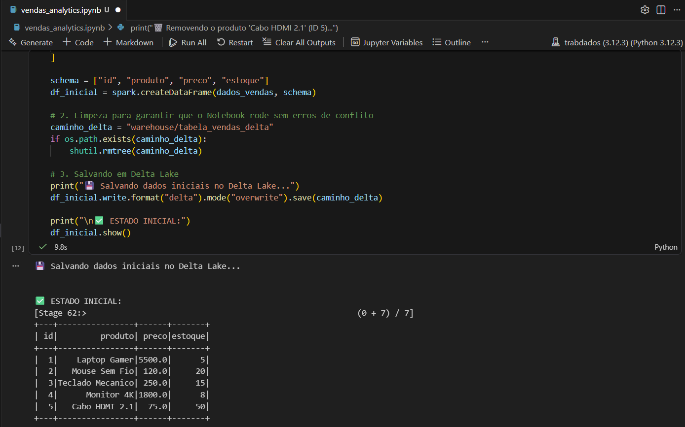
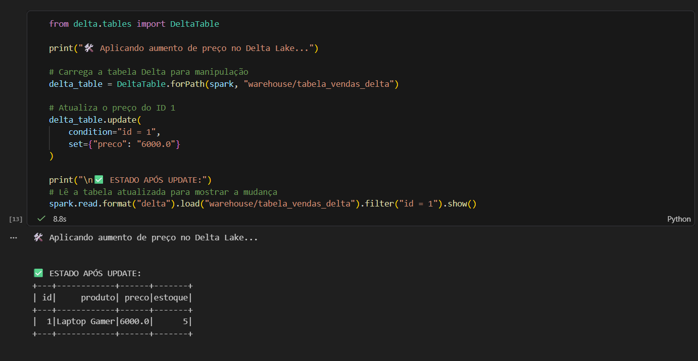
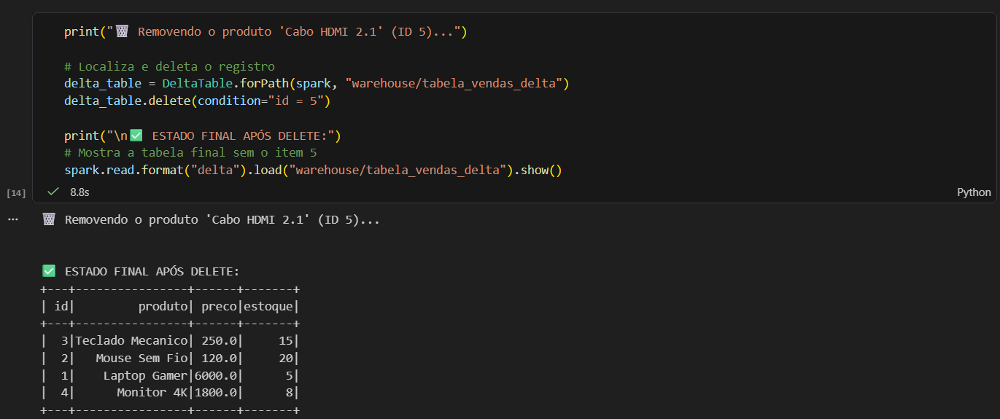

# Operações CRUD no Delta Lake

Abaixo, as evidências das operações realizadas no notebook provando as propriedades ACID:

### 1. Inserção de Dados (INSERT)

### 2. Atualização de Preço (UPDATE)

### 3. Remoção de Registro (DELETE)
