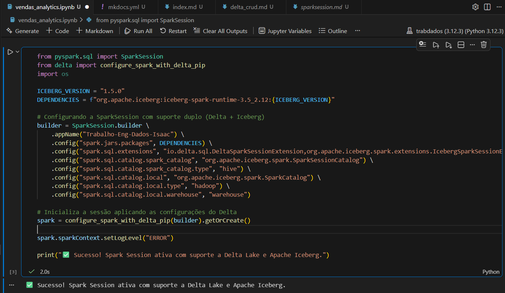

# Configuração da Spark Session

Para este projeto, configuramos uma **Spark Session** robusta capaz de lidar simultaneamente com os formatos **Delta Lake** e **Apache Iceberg**.

### Implementação do Ambiente
Utilizamos o gerenciador de pacotes **uv** para garantir a reprodutibilidade das bibliotecas, incluindo:
* `pyspark`
* `delta-spark`
* `pyiceberg`

### Validação da Conexão
Abaixo, a evidência de que o motor Spark inicializou corretamente com todos os pacotes carregados no ambiente WSL2:

